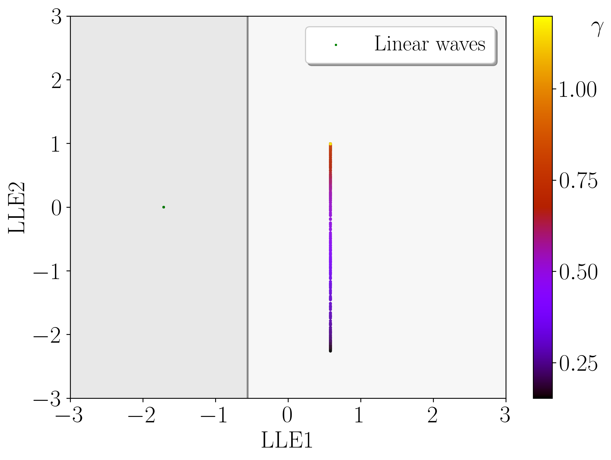
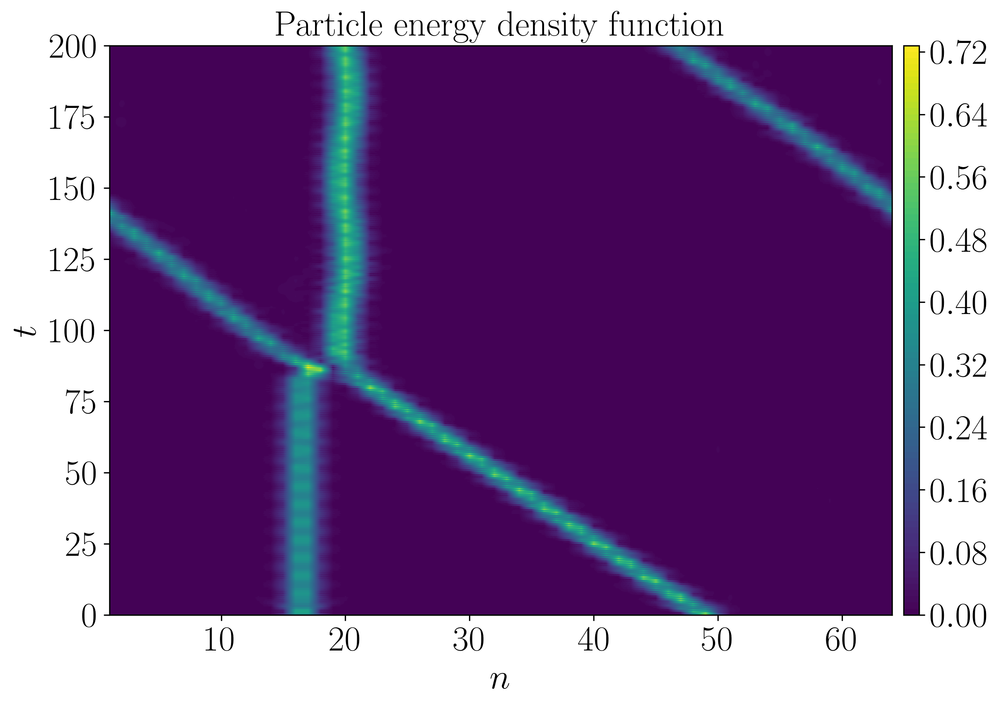
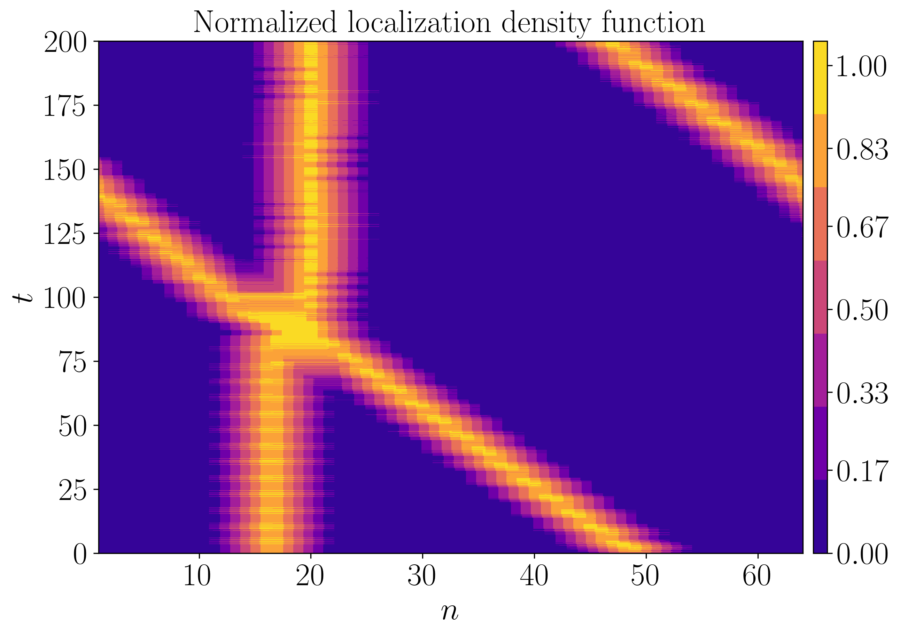

# LocalizedWaveIdentification

Python code for identification of localized energy and nonlinear waves in numerical simulations of one-dimensional crystal lattice models. Using the code and developed methodology, please cite Bajārs, J., Kozirevs, F.: *Data-driven intrinsic localized mode detection and classification in one-dimensional crystal lattice model*. Physics Letters A **436**, 128071 (2022), [DOI: 10.1016/j.physleta.2022.128071](https://doi.org/10.1016/j.physleta.2022.128071).

File `LocalizedWaveIdentification_PureCode_WithoutData.zip` contains pure code without precomputed data and images.

   &nbsp;    
   &nbsp;   
   

This research has been financially supported by the specific support objective activity 1.1.1.2. “Post-doctoral Research Aid” of the Republic of Latvia (Project No. 1.1.1.2/VIAA/4/20/617 “Data-Driven Nonlinear Wave Modelling”), funded by the European Regional Development Fund (project id. N. 1.1.1.2/16/I/001).

#### Instructions to run the code
- To perform a numerical simulation, run the file `main.m`.
- Initial conditions and the choice of the numerical method are set in the same file `main.m`.
- All parameter values are defined in the file `Parameter_Values.m`.
- All variables are initialized in the file `Define_Variables.m`. 
- For convenience, all parameter values and variables are stored in structures: `parm` and `vars`, respectively.
- All functions and numerical methods can be found and are defined in the folder `Functions`.
- Optionally, simulation data and figures can be saved in the following folders: `SavedData` and `Figures`, respectively.
